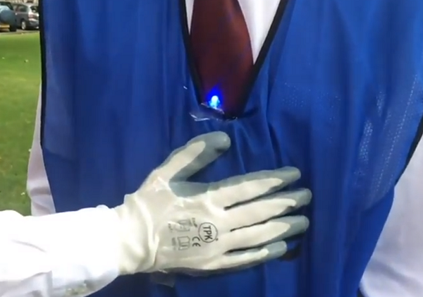

## Introduction

Create an outdoor physical computing tag game with RFID readers.

This resource is a simplified version of an [original idea](https://youtu.be/CM7YRi4nfeQ){:target="_blank"} by the winning Pioneers team **Robot Apocalypse Committee** for the _Make it outdoors_ theme!

### What you will make

Each player will wear a shirt with an integrated Raspberry Pi, RFID reader, and LED, and they will also wear a glove with an attached RFID tag.

When a player is tagged, their LED will change colour to show they have been caught.

### What you will learn

This project covers elements from the following strands of the [Raspberry Pi Digital Making Curriculum](http://rpf.io/curriculum){:target="_blank"}:

+ [Combine inputs and/or outputs to create projects or solve a problem](https://curriculum.raspberrypi.org/physical-computing/builder/){:target="_blank"}

+ [Apply basic programming constructs to solve a problem](https://curriculum.raspberrypi.org/programming/builder/){:target="_blank"}

### Additional information for educators

If you need to print this project, please use the [printer-friendly version](https://projects.raspberrypi.org/en/projects/pi-tag/print){:target="_blank"}.

Use the link in the footer to access the GitHub repository for this project, which contains all resources (including an example finished project) in the 'en/resources' folder.
