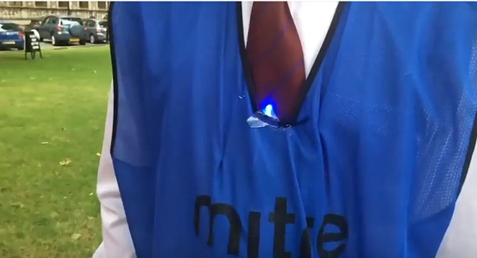
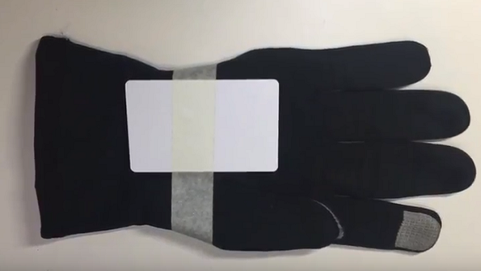

## Put it all together

Now you need to put your kit inside the clothing you are using. The **Robot Apocalypse Committee** Pioneers team who came up with the idea for this resource put their RFID reader and LED inside a sports bib:

You will need to connect your USB power pack to the Raspberry Pi in order to power it, and then stitch a pouch to hold all of the components.

They then taped the corresponding RFID card to a glove:

+ Assemble your kit in your chosen clothing and try out the game!
