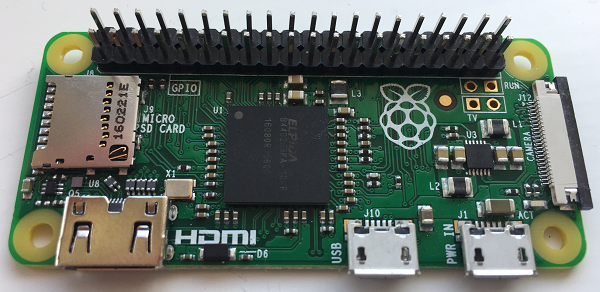

## Attach the header

If you're using a Raspberry Pi Zero WH, you're all set to move on to the next step.

Your Raspberry Pi Zero/Zero W will need a male header so that you can attach the RFID reader to attach to it. You can easily solder the header on. (If you don’t want to solder, you could try the [hammer header](https://shop.pimoroni.com/products/gpio-hammer-header){:target="_blank"} instead.)

+ The Pi Zero must be completely unplugged and powered off before you attempt any soldering.

+ If your header is longer than the number of pins needed (40), carefully break it off to the right length. Insert the header into the holes in the Pi Zero with the longer pins facing upwards.

+ Using a soldering iron, carefully solder each of the pins on the header to the bottom of the Pi Zero, making sure there is enough solder to create a good connection for each one.

For detailed instructions on how to do the soldering, take a look at our [_Getting started with soldering_](https://projects.raspberrypi.org/en/projects/getting-started-with-soldering){:target="_blank"} resource.
