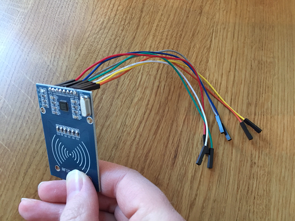
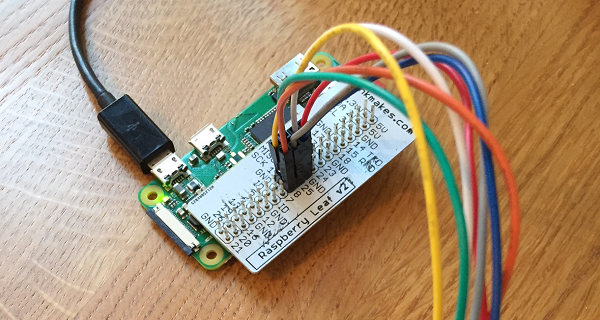

## Set up the RFID reader

For this project, we used the [MonkMakes clever card kit](https://www.monkmakes.com/cck/){:target="_blank"} which comes with full instructions for setting up the RFID reader and connecting it to the Raspberry Pi.

+ Connect the seven female-female jumper leads to your RFID reader.

+ Connect the other end of each lead to the specified pin in the instructions for your RFID reader.

+ Power on your Raspberry Pi Zero, either with the usual peripherals or with only a power lead as a [remote setup](https://www.raspberrypi.org/learning/teachers-guide/remote/){:target="_blank"}. You should see a red light on the RFID reader to indicate that it has power.
