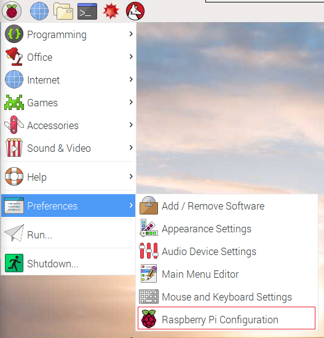
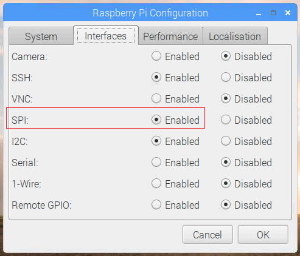

## Test the RFID reader

Let's test that the RFID reader works properly.

+ Open the Raspberry Pi configuration menu



+ Make sure that SPI is enabled - this is how your RFID reader will talk to the Raspberry Pi.



+ Reboot the Raspberry Pi.

+ Open a terminal and make sure you are in the `/home/pi` directory by typing `cd /home/pi`.

+ Install SPI-Py by typing the following commands, each followed by <kbd>Enter</kbd> on the keyboard.

```
git clone https://github.com/mab5vot9us9a/SPI-Py  
cd SPI-Py
sudo python3 setup.py install
```
