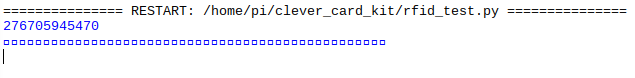

## Test the RFID reader

Let's test whether the RFID reader works properly.

+ Open the Raspberry Pi configuration menu.


+ Make sure that SPI is enabled — this is how your RFID reader will talk to the Raspberry Pi.


+ Reboot the Raspberry Pi.

+ Make sure you have installed the required software (see the "What you will need" step). You will notice that some extra folders have been created inside your `/home/pi` directory.

Next you will write some code to test whether your RFID reader can read a tag.

+ Open IDLE and create a new file called `rfid_test.py`, and make sure to save this file in the `clever_card_kit` folder.

[[[rpi-gui-idle-opening]]]

+ Begin by importing two libraries needed to communicate with the RFID reader:

```python
import RPi.GPIO as GPIO
import SimpleMFRC522
```
+ Next, create a connection to the RFID reader. If you have used a Sense HAT, you might notice that this line of code is similar to the line of code where you create a connection to the Sense HAT.

```python
reader = SimpleMFRC522.SimpleMFRC522()
```
+ Add some code to read from the card. Each card contains an ID number and some text. The following code contains an infinite loop so that you can read multiple cards one after another.

```python
try:
    while True:
        card_id, card_text = reader.read()
        print(card_id)
        print(card_text)
```

You may not have seen `try:` before — this just allows us to tell Python to run the code as normal and then use `finally:` to clean up at the end.

+ Finally, add a line of code to clear up and close any connections with the GPIO pins. The `finally:` should be level with `try:` in terms of indentation.

```python
finally:
    GPIO.cleanup()
```

Using `finally:` means that the GPIO clean-up will happen every time you exit the program, and this will prevent errors from occurring when you restart the program.

+ Save and run your code. Hold your RFID card next to the reader and check that a value appears in the shell.



+ Close the Python shell to exit the infinite loop in the `rfid_test.py` script. 
