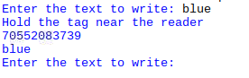

## Write to a card

Each RFID tag or card has a very small amount of memory which can be written to. You can only write up to 48 characters, so let's write the player's name onto the card.

+ Make a copy of your test program and call it `write_name.py`. Save it in the same folder.

+ Locate this line of code which reads a card and remove it:

```python
card_id, card_text = reader.read()
```

Instead, you will write some text to the card. First you need to know what text to add:

+ In place of the line you deleted, add a line of code to ask the user to input the text they would like to write to the card:

```python
text = input("Enter the text to write: ")
```

+ Underneath that, add a line of code to write the text to the card:

```python
print("Hold the tag near the reader")
card_id, card_text = reader.write(text)
```

+ Save and run your program. Enter the text you would like to write to the tag, then when prompted hold your tag near the RFID reader.


