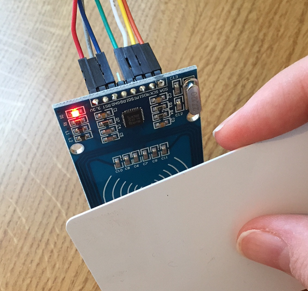

## Write to a card

Each RFID tag or card has a very small amount of memory that you can save only write up to 48 characters in. Let's write the name of a colour onto the card, so that each player can have their own colour.

+ Make a copy of your test program and call it `write_card.py`. Save it in the same folder.

+ Locate this line of code that reads a card, and remove it:

```python
card_id, card_text = reader.read()
```

Instead, you will write some text to the card. First you need to know what text to add:

+ In place of the line you deleted, add a line of code to ask the user to input the text they would like to write to the card:

```python
text = input("Enter the text to write: ")
```

+ Below that, add a line of code to instruct the player to hold the card to the reader, and another line to then write the text to the card:

```python
print("Hold the tag near the reader")
card_id, card_text = reader.write(text)
```

+ Save and run your program. Enter the text you would like to write to the card (e.g. `blue`), then when prompted, hold your tag near the RFID reader to write that text to the card.


+ If you want to check whether the write has worked, close the Python shell, and then run your `rfid_test.py` program before scanning the card. You should see that the text you entered (e.g. `blue`) is now associated with the card you used.



+ Write the word `red` to a second card, as we will need this to test the game out in a later step.
