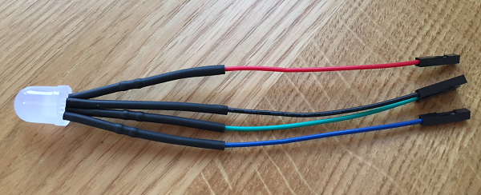

## Add an LED

Each player will have a colour that will be displayed by an LED. When they are tagged by another player, their LED will change colour to that player's colour.

First, let's connect the LED to the Raspberry Pi. If you are using the LED which comes with the kit, it will already have jumper wires and resistors attached.



--- collapse ---
---
title: Instructions if your RGB LED is not pre-wired
---
If you bought your LED separately, you will need to do some soldering.
+ Solder a 100 Ohm resistor to each of the short legs of the LED.
+ Attach a female-female jumper lead to the other end of each resistor.
+ Add one more female-female lead directly attached to the long leg of the LED.

If you are just prototyping your circuit, you could avoid soldering by attaching the RGB LED and resistors to a breadboard, although you will need to remove the breadboard to be able to attach the LED to the vest.

The longest leg of your LED is probably the **cathode**, which means it should be attached to the ground pin **GND**. On some RGB LEDs, the longest leg is the **anode**. which should be attached to the **3v3** power pin. Unless you already know which type of LED you have, attach the longest leg to a **GND** pin, and the other three legs to free GPIO pins. If the LED does not seem to be working, swap the wire connected to **GND** to the **3v3** pin.

--- /collapse ---

+ Connect the black wire to a **GND** (ground) pin on the Raspberry Pi.

+ Connect each of the coloured wires to a free GPIO pin on the Raspberry Pi. You can use any free pin, but in this resource we will connect red to **GPIO 18**, green to **GPIO 23**, and blue to **GPIO 24**.

+ Create a new Python file called `led_test.py`, and save it in the same folder as your previous files.

+ + At the top of your new file, import the `RGBLED` class from the `gpiozero` library to control your LED.

```Python
from gpiozero import RGBLED
```

+ Create a connection to the LED. (You will need to specify which pin you connected each of the colours to, so if you used different pins to our example, remember to change the pin numbers in the code accordingly.)

```python
led = RGBLED(red=18, green=23, blue=24)
```
+ Finally, set the LED's blue level to `1`, which is the maximum possible:

```python
led.blue = 1
```

+ Save and run your program. You should see the LED light up in blue. Be patient — it might take a few seconds for your program to run.
