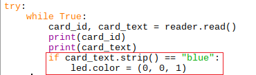

## Tag!

Now we need to combine the two programs so that when a player 'tags' another player's RFID reader with their tag, the LED changes colour.

+ Open up your `rfid_test.py` file and save a copy of the file in the same folder, called `tag_game.py`

+ At the top of your program with the other import statements, import the RGBLED class from the gpiozero library

```python
from gpiozero import RGBLED
```

+ Underneath the line of code where you connect to the RFID reader, add a line of code to set up the LED, turn it white and print `"Ready"` so you know when everything is set up ready to begin the game.

```python
led = RGBLED(red=18, green=23, blue=24)
led.color = (1, 1, 1)
print("Ready")
```

You might be wondering why `(1, 1, 1)` turns the LED white. The three numbers represent the amount of red, green and blue in that order. Using the full amount of each colour (in this case, 1) makes white.

[[[generic-theory-simple-colours]]]

+ Add some code to turn the LED red if a card which has the text `red` is placed near it.



The colour red is `(1, 0, 0)` because the numbers represent the amount of red, green, blue in that order. We also need to `.strip()` the text before we compare it as it will have whitespace characters attached.

+ Now use an `elif` to add another piece of code to turn the LED blue if a card which has the text `blue` is held near it.

```python
elif card_text == "blue":
    led.color = (0, 0, 1)
```

+ Save your program and run it. Hold your red card next to the reader and check that the LED turns red, and hold the blue card near it to check that the LED turns blue.
